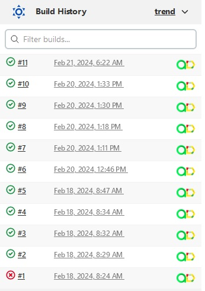

# Проект по автоматизации тестирования API для сайта [Reqres](https://reqres.in/)


## :clipboard: Содержание:
* <a href="#tools">Используемый стек</a>
* <a href="#cases">Примеры автоматизированных тест-кейсов</a>
* <a href="#console">Запуск из терминала</a>
* <a href="#jenkins">Сборка в Jenkins</a>
* <a href="#allure">Allure отчет</a>
* <a href="#allureTestOps">Интеграция с AllureTestOps</a>
* <a href="#jira">Интеграция с Jira</a>
* <a href="#telegram">Интеграция с Telegram ботом</a>


____
<a id="tools"></a>
## :computer:<a name="Используемый стек">**Используемый стек:**</a>

<p align="center">
<a href="https://www.java.com/"></a>
<a href="https://selenide.org/"></a>
<a href="https://github.com/allure-framework/allure2"></a>
<a href="https://qameta.io/"></a>
<a href="https://gradle.org/"></a>
<a href="https://github.com/"></a>
<a href="https://www.jenkins.io/"></a>
<a href="https://web.telegram.org/a/"></a>
<a href="https://www.atlassian.com/ru/software/jira/"></a>
<a href="https://junit.org/junit5/"></a>
<a href="https://www.jetbrains.com/ru-ru/idea/"></a>
  
В проекте средой разработки выступает `IntelliJIDEA`. Сборщик библиотек и плагинов `Gradle`, к которому мы подключили `Java`, `JUnit5`, `Selenide`, `RestAssured`, `Allure`. Автотесты были написаны на языке `Java`, с помощью библиотеки для тестирования api `RestAssured`. В качестве отчетности о выполнении тестов выступает `Allure`.
Все тесты проходили на удаленном сервере `Selenoid`, а для удаленного запуска тестов использовался `Jenkins`,к которому мы подключили `AllureTestOps` для сбора статистики о тестах, `Jira` для создания тикетов, и бота с отчетом в `Telegram`. 

</p>

____
<a id="cases"></a>
## :pushpin: <a name="Примеры автоматизации Rest-Api">**Примеры автоматизации Rest-Api:**</a>
**POST-запросы:**
-  Успешная авторизация пользователя
-  Успешная регистрация пользователя
-  Регистрация без заполнения поля "job"
-  Регистрация без поля "password"
-  Авторизация без поля "password"
  
**GET-запросы:**
-  Проверка на существующего пользователя с id=2 и его данными
-  Проверка неизвестного существующего пользователя с id=2 и его данными
-  Проверка на несуществующего пользователя

**PUT-запросы:**
-  Изменение имени и места работы пользователя

____

<a id="console"></a>
## :keyboard: Запуск автотестов


Локальный запуск тестов:
```bash  
gradle clean test_suite
gradle clean positive_tests
gradle clean negative_tests
```
____
<a id="jenkins"></a>
## </a><a name="Сборка"></a>Сборка в [Jenkins](https://jenkins.autotests.cloud/job/portfolio_reqres_api_test_23/)</a>
Для запуска сборки необходимо перейти в раздел `Build with Parameters` выбрать нужные вам параметры и нажать кнопку `Build`.
<p align="center">  

</p>
После выполнения сборки, в блоке <code>Build history</code> напротив номера сборки появятся значки <code>Allure Report</code> и <code>Allure TestOps</code>, при клике на которые откроется страница с сформированным html-отчетом и тестовой документацией соответственно.


<p align="center">   
</a>
</p>

____

<a id="allure"></a>
##  Allure <a target="_blank" href="https://jenkins.autotests.cloud/job/portfolio_reqres_api_test_23/12/allure/">отчёт</a>

Основная страница отчёта

<p align="center">  
  
</p>  

Подробный отчёт одного из тест-кейсов. На вкладке <code>Behaviors</code> можно рассмотреть каждый тест-кейс. Также можно подробно посмотреть тело запроса, ответа на отдельной html-странице.
<p align="center">  
  
</p>

____


<a id="allureTestOps"></a>
## <a name="Интеграция AllureTO"></a>Интеграция с [AllureTestOps](https://allure.autotests.cloud/project/4047/dashboards)</a>
На `Dashboard` в `Allure TestOps` видна статистика тестирования: количество тест-кейсов, автоматизированных тестов, количество запусков тест-кейсов.
<p align="center">  

</p>

Во вкладке <code>Test-cases</code> представлены все существующие тест-кейсы с подробным описанием(телом запроса, ответа, тегами, историей).

<p align="center">   

</p>

Каждый тест-кейс имеет интеграцию с <code>Jira</code>. При клике на линк, мы попадем на задачу тест-кейса в <code>Jira</code>.

<p align="center">   

</p>


____


<a id="jira"></a>
## <a name="Интеграция Jira"></a>Интеграция с [Jira](https://jira.autotests.cloud/browse/HOMEWORK-1112)</a>
Реализована интеграция `Allure TestOps` с `Jira`, в тикете отображается, какие тест-кейсы были написаны в рамках задачи и результат их прогона.
<p align="center">  

</p>

____

<a id="telegram"></a>
##  Уведомления в Telegram с использованием бота.
После завершения сборки <code>Telegram</code> бот, автоматически обрабатывает информацию и отправляет сообщение с отчетом о прогоне тестов.

<p align="center">

</p>
